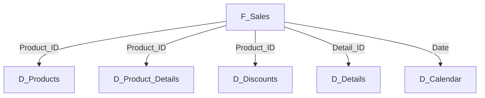

# Project Challenge: Star Schema Model in Power BI

This repository contains the solution for the project challenge of building a star schema model using Power BI. Below, we detail the step-by-step process, project stages, functionalities, and DAX functions used.

## Challenge Objective

Create a star schema model from a single table called **Financial Sample**. The project involves creating dimension and fact tables based on the original table, using Power BI modeling and calculation features. The goal is to model and transform data using DAX (Data Analysis Expressions), a powerful language that allows users to create custom formulas and expressions to manipulate and analyze data.

## Project Structure

The project consists of creating the following tables:

- **Financials_source**: Original table used as a backup (hidden mode).
- **D_Products**: Contains information about products and sales statistics.
- **D_Product_Details**: Additional details about products.
- **D_Discounts**: Information about applied discounts.
- **D_Details**: Additional information not included in the other tables.
- **D_Calendar**: Calendar table created using the DAX `CALENDAR()` function.
- **F_Sales**: Fact table consolidating sales information.

---

## Step-by-Step Guide

### 1. Initial Setup
1. Import the **Financial Sample** table into Power BI.
2. Rename the imported table to **Financials_source** and set it to hidden mode to prevent direct modifications.

### 2. Creating Dimension Tables

#### a) **D_Products**
1. Duplicate the **Financials_source** table and rename it to **D_Products**.
2. Select the following columns:
   - `Product_ID`
   - `Product`
3. Create the following metrics using DAX:
   - **Average Units Sold:** `AVERAGE(Units Sold)`
   - **Average Sales Value:** `AVERAGE(Sales)`
   - **Median Sales Value:** `MEDIAN(Sales)`
   - **Maximum Sales Value:** `MAX(Sales)`
   - **Minimum Sales Value:** `MIN(Sales)`

#### b) **D_Product_Details**
1. Create a new table and include the columns:
   - `Product_ID`
   - `Discount Band`
   - `Sale Price`
   - `Units Sold`
   - `Manufacturing Price`

#### c) **D_Discounts**
1. Duplicate the original table and select the columns:
   - `Product_ID`
   - `Discount`
   - `Discount Band`

#### d) **D_Details**
1. Create a table to store additional sales information not included in other tables.

#### e) **D_Calendar**
1. Create a calendar table using the DAX function:
   ```DAX
   D_Calendar = CALENDAR(MIN(Financials_source[Date]), MAX(Financials_source[Date]))
   ```
   2. Add additional columns for analysis, such as:
   ```DAX
   WEEK_NUMBER = WEEKNUM('D_Calendar'[Date])
   MONTH = FORMAT(DATE(1, 'D_Calendar'[MONTH NUMBER], 1), "MMM")
   ```

### 3. Creating the Fact Table (**F_Sales**)
1. Create a new table consolidating essential sales data:
   - `SK_ID`
   - `Product_ID`
   - `Product`
   - `Units Sold`
   - `Sales Price`
   - `Discount Band`
   - `Segment`
   - `Country`
   - `Sellers`
   - `Profit`
   - `Date`

### 4. Diagram Modeling
1. Rearrange the tables in the data model to form the star schema:
   - Place the **F_Sales** table in the center.
   - Connect the dimension tables to it via foreign keys.
2. Define the appropriate relationships between the tables.
3. Ensure there are no relationships between dimension tables, as this is a star schema, not a snowflake schema.

---

## DAX Functions Used

- `AVERAGE()`: Calculates the average.
- `MEDIAN()`: Calculates the median.
- `MAX()`, `MIN()`: Identifies the maximum and minimum values.
- `CALENDAR()`: Creates the calendar table.
- `WEEKNUM()`: Extracts the week number from a date.
- `FORMAT()`: Formats date or numeric data into a specified format.

---

## Save and Document the Project

1. Save the **.pbix** file.
2. Export an image of the star schema diagram.
3. Upload the project to a GitHub repository with the detailed README.md file.

---

## Model Schema

The diagram below shows the star schema model created in Power BI:



---

## Repository Example

Include in this repository:
- **.pbix** file.
- Star schema diagram image.
- This detailed README.md file.

Now, we are prepared to share our project with the community!
